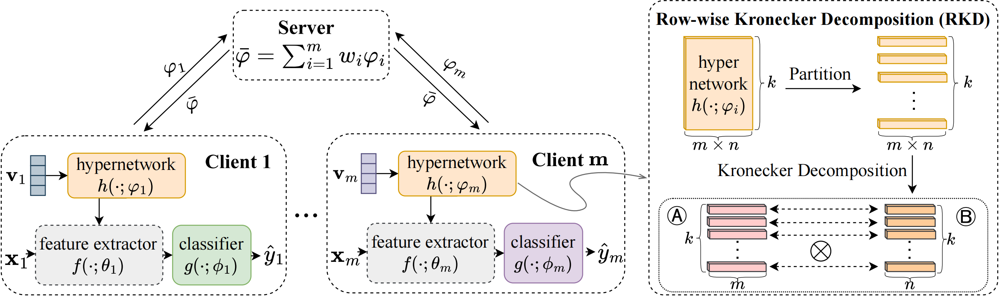

# HyperFL++

The implementation of A Novel Federated Learning Framework Against Gradient Inversion Attacks. \
[Pengxin Guo](https://pengxin-guo.github.io)\*, Ziying Huang\*, [Shuang Zeng](https://scholar.google.com/citations?user=yTP1oqkAAAAJ&hl=en), Wenhao Chen, Xiaodan Zhang, Weihong Ren, Yuyin Zhou, and [Liangqiong Qu](https://liangqiong.github.io).

 

##### Figure 1. *Left*. Current approaches focus on protective techniques for shared gradients, such as SMC, HE, and DP, which naturally entail significant privacy-utility trade-offs. *Right*. A new FL framework is introduced that “breaks the direct connection” between the shared parameters and the local private data, aiming to achieve an optimal balance between privacy and utility.

 

##### Figure 2. *Left*. Illustration of **HyperFL++**. HyperFL++ divides each client's network into two components: the feature extractor $f(; \theta_i)$ and the classifier head $g(; \phi_i)$. An auxiliary hypernetwork, denoted as $h(; \varphi_i)$, is employed to create the feature extractor $f(; \theta_i)$ using the client’s specific private embedding vector $\mathbf{v}_i$, such that ${\theta_i} = h(\mathbf{v}_i; \varphi_i)$. These parameters are then utilized to derive features from the input ${x}_i$, which are subsequently processed by the classifier to produce the output $\hat{y}_i$, represented as ${\hat{y}_i} = g(f(x_i; \theta_i); \phi_i).$ During the FL process, the hypernetwork $\varphi_i$ is the only element shared with the server, while all other components remain private. This approach effectively addresses privacy leakage concerns. *Right*. **Row-wise Kronecker Decomposition (RKD)**. The hypernetwork parameters (matrices) are first partitioned into rows, and then Kronecker decomposition is applied to each row. $\otimes$ denotes the Kronecker product.


## Requirements

Some important required packages are lised below:

- Python 3.10
- Pytorch 2.0.1
- torchvision 0.15.2
- timm 0.9.2


## Usage

### 1. Create a conda environment

```bash
cd ./HyperFL
conda create -n hyperfl++ python=3.10
conda activate hyperfl++
pip install -r requirements.txt
```

### 2. Train and test the model
#### HyperFL
```bash
cd ./cnn
python federated_main.py --gpu 0 --train_rule HyperFL++ --dataset cifar --local_bs 50 --lr 0.02 --num_users 20 --frac 1.0
```

#### HyperFL-LPM

```bash
cd ./vit
python federated_main.py --gpu 0 --train_rule HyperFL++-LPM --dataset cifar
```


## Acknowledgement
We would like to thank the authors for releasing the public repository: [FedPAC](https://github.com/JianXu95/FedPAC).